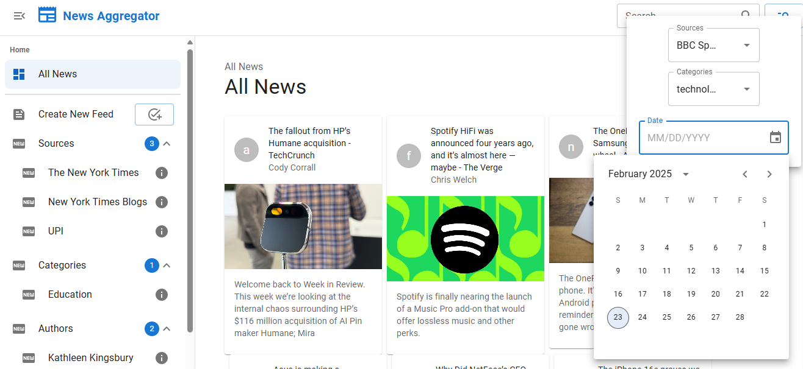

## News Aggregator

The project is a news aggregator website that pulls articles from various sources and displays them in a clean, easy-to-read format.

## Built With

## Features

** Requirements **

- Article search and filtering: Users should be able to search for articles by keyword and filter the results by date, category, and source.

- Personalized news feed: Users should be able to customize their news feed by selecting their preferred
  sources, categories, and authors.

- Mobile-responsive design: The website should be optimized for viewing on mobile devices

**All functionality **

- Redux for state managemnet.
- TypeScript for fully typed code.
- MUI for styling.
- Using [IDB-Keyval](https://www.npmjs.com/package/idb-keyval/v/3.0.0) for caching http request and response (This is a super-simple-small promise-based keyval store implemented with IndexedDB, largely based on async-storage by Mozilla).
- Todo (InIncluded): React Testing Library (RTL) and Jest for unit testing.
- Todo (InIncluded): In some cases the code is not completed like showing the exact articles after clicking on preferred feeds in sidebar.

## API Reference

| Api Name                | Method | Reference                                                       |
| :---------------------- | :----- | :-------------------------------------------------------------- |
| `News API`              | `GET`  | [Ref](https://newsapi.org/v2//top-headlines)                    |
| `BBC News API`          | `GET`  | [Ref](https://newsapi.org/v2//top-headlines?source=bbc-news)    |
| `New York Times API`    | `GET`  | [Ref](https://api.nytimes.com/svc/search/v2/articlesearch.json) |
| `The Guardian News API` | `POST` | [Ref](https://content.guardianapis.com/search)                  |

To access an API key for the News API, including News API, follow these steps:

- Sign Up: Go to [News API documentation](https://newsapi.org/docs/get-started), [The Guardian's Open Platform](https://open-platform.theguardian.com/), [Developer Network](https://developer.nytimes.com/) and sign up for an account.

- Get API Key: Once you have an account, you can generate an API key from the dashboard.

## Run Locally

| Function        | Description                                 |
| :-------------- | :------------------------------------------ |
| `npm run dev`   | Navigate to `http://http://localhost:5173/` |
| `npm run build` | Build                                       |
| `npm run test`  | Running unit tests                          |
| `npm run start` | Start the server                            |

## Run by Docker

| Function                    | Description                               |
| :-------------------------- | :---------------------------------------- |
| `docker-compose up`         | Run the container using Docker Compose    |
| `docker-compose down`       | Stop the container                        |
| `docker-compose up --build` | Building and Running the Docker Container |

Once the build is complete, Docker Compose will automatically start the container. You can access your application by navigating to http://localhost:5173 in your browser.

## View(Demo) of project

